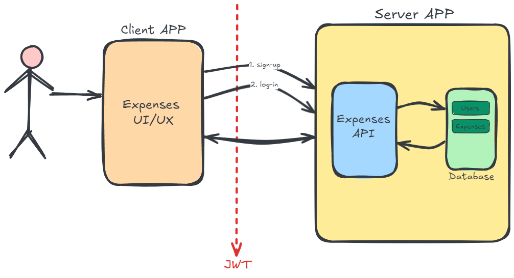
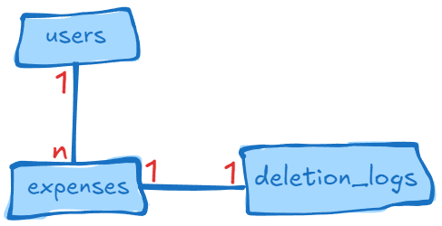

# Web API Expense Tracker #
This is a API RESTfull for managing expenses.

## Features
Berikut adalah fitur-fitur yang ada di **_Expense Tracker API_**:
- _Registrasi_ untuk pengguna  baru
- _Login_ untuk pengguna, hasilkan dan validasi token _JWT_ untuk menangani _authentication_ dari pengguna.
- Menambahkan pengeluaran baru
- Menghapus pengeluaran yang ada (soft delete)
- Memperbaharui pengeluaran yang ada
- pengguna dapat melihat dan memfilter daftar pengeluaran mereka berdasarkan beberapa kriteria waktu yang berbeda:
    - Minggu lalu - Filter pengeluaran yang dibuat dalam 7 hari terakhir
    - Bulan lalu - Filter pengeluaran yang dibuat dalam 30 hari terakhir
    - 3 Bulan terakhir - Filter pengeluaran yang dibuat dalam 3 bulan terakhir (90 hari)
    - Kostum - Pengguna bisa memilih sendiri rentang waktu, yaitu dengan menentukan tanggal mulai dan tanggal akhir secara manual

## Architecture Application

## Design Schema Database

## Tech Stack
Daftar framework & library apa saja yang digunakan:
- [golang](https://go.dev/) - Programming language
- [postgreSQL](https://www.postgresql.org/docs/) - Relational database
- [redis](https://redis.io/docs/latest/develop/) - Caching database
- [docker](https://www.docker.com/) - Docker
- [gin](https://gin-gonic.com/) - Web Framework
- [GORM](https://gorm.io/docs/index.html) -  Sql mapping object
- [viper](https://github.com/spf13/viper) - configuration file
- [logrus](https://github.com/sirupsen/logrus) - Logger
- [migrate](https://github.com/golang-migrate/migrate) - Golang database migration
- [Go Playground Validator](https://github.com/go-playground/validator) - Validation
- [go jwt](https://github.com/golang-jwt/jwt) - JSON Web token
- [testify](https://github.com/stretchr/testify) - Testing toolkit
- [gomock](https://github.com/golang/mock) - Mocking framework

## API Documentation
Api spec is in directory [docs](./docs)

## How to run application?
### Local development usage
    make local
    make run

### Docker development usage  
    make develop