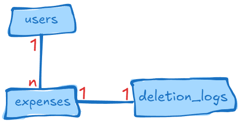

# Web API Expense Tracker #
This is a API RESTfull for managing expenses.

## Features
Berikut adalah fitur-fitur yang ada di **_Expense Tracker API_**:
- _Registrasi_ untuk pengguna  baru
- _Login_ untuk pengguna, hasilkan dan validasi token _JWT_ untuk menangani _authentication_ dari pengguna.
- Menambahkan pengeluaran baru
- Menghapus pengeluaran yang ada (soft delete)
- Memperbaharui pengeluaran yang ada
- pengguna dapat melihat dan memfilter daftar pengeluaran mereka berdasarkan beberapa kriteria waktu yang berbeda:
    - Minggu lalu - Filter pengeluaran yang dibuat dalam 7 hari terakhir
    - Bulan lalu - Filter pengeluaran yang dibuat dalam 30 hari terakhir
    - 3 Bulan terakhir - Filter pengeluaran yang dibuat dalam 3 bulan terakhir (90 hari)
    - Kostum - Pengguna bisa memilih sendiri rentang waktu, yaitu dengan menentukan tanggal mulai dan tanggal akhir secara manual

## Architecture Application

## Design Schema Database

## Teck Stack
- [Golang](https://go.dev/) (programming language)
- [PostgreSQL](https://www.postgresql.org/docs/) (relational database)
- [Redis](https://redis.io/docs/latest/develop/) (caching database)
- [Docker](https://www.docker.com/) (containerize)

## Framework & Library
- [Gin](https://gin-gonic.com/) (web framework)
- [GORM](https://gorm.io/docs/index.html) (ORM)
- [Godotenv](https://github.com/joho/godotenv) (configuration)
- [Logrus](https://github.com/sirupsen/logrus) (logger)
- [Golang Migrate](https://github.com/golang-migrate/migrate) (database migration)
- [Go Playground Validator](https://github.com/go-playground/validator) (validation)
- [Go JWT](https://github.com/golang-jwt/jwt) (access token)

## API Documentation
Api spec is in directory [docs](./docs)